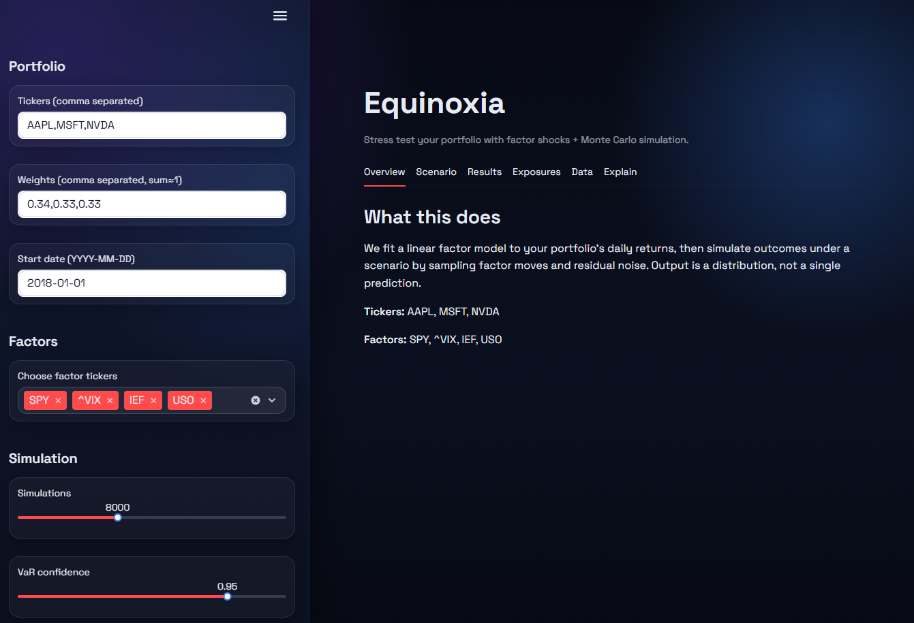
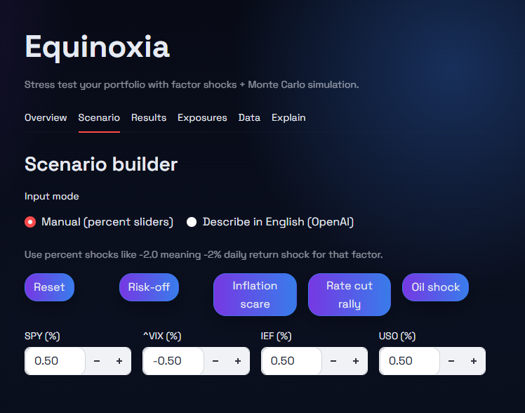
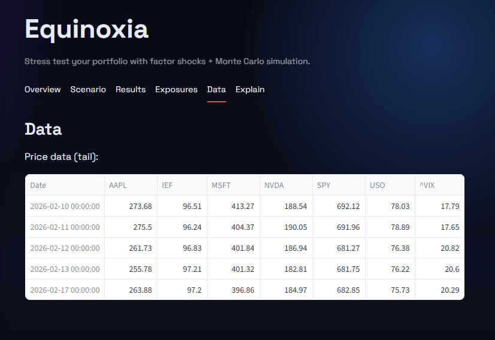
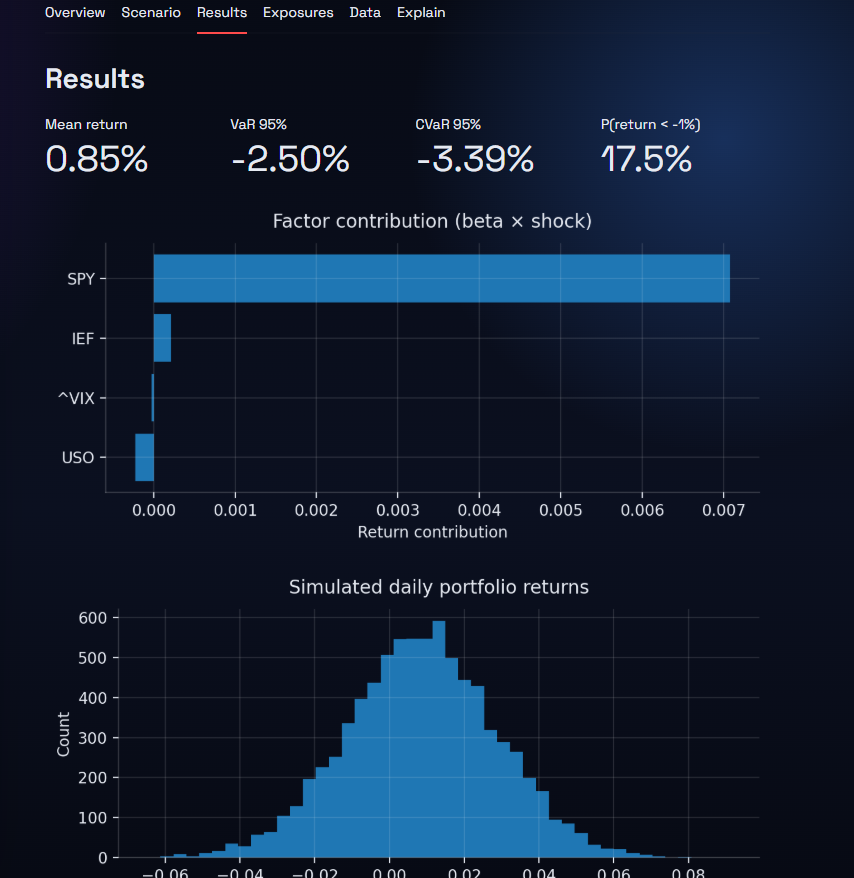
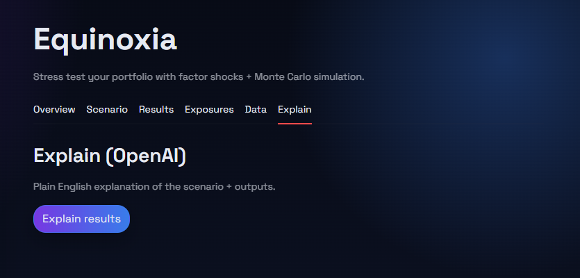

# Equinoxia

Stress test your stock portfolio using a linear factor model + Monte Carlo simulations.  
Equinoxia allows you to build scenarios with factor shocks or by describing a scenario in English, and simply view simulated return distributions and risk metrics like Var/CVaR.

---
## Demo Preview

### Landing Page


### Scenario Builder


### Data Table


### Visualizations


### Explain Tab


---

## Features
- Portfolio input: tickers + weights
- Factor selection (e.g., SPY, VIX, IEF, USO, UUP)
- Fits a linear factor regression to daily returns
- Monte Carlo simulation of daily portfolio outcomes
- Scenario builder:
  - Manual % shocks per factor
  - Natural-language parsing into shocks (OpenAI API)
- Outputs:
  - Mean simulated return
  - VaR and CVaR at a chosen confidence level
  - Probability of loss beyond a threshold
  - Charts: return histogram + factor contribution

---

## Tech Stack
- **Python**
- **Streamlit**
- **NumPy / Pandas**
- **scikit-learn** (LinearRegression)
- **yfinance** (historical prices)
- **Matplotlib**
- **OpenAI API** (scenario parsing + explanations)
- **python-dotenv** for local environment variables

---

## Repository Setup (Local)

### 1) Clone the repo
```bash
git clone https://github.com/tian9801/Equinoxia.git
cd Equinoxia
```
### 2) Create a virtual environment

**macOS / Linux**
```bash
python3 -m venv .venv
source .venv/bin/activate
```

**Windows (PowerShell)**
```powershell
python -m venv .venv
.\.venv\Scripts\Activate.ps1
```

### 3) Install dependencies
```bash
pip install -r requirements.txt
```

### 4) (Optional) Add OpenAI API key
Create a file named `.env` in the project root and add
```
OPENAI_API_KEY=insert_api_key_here
```

### 5) Run the app
```bash
streamlit run app.py
```

### 6) Deactivate the environment when finished (optional)
```bash
deactivate
```
